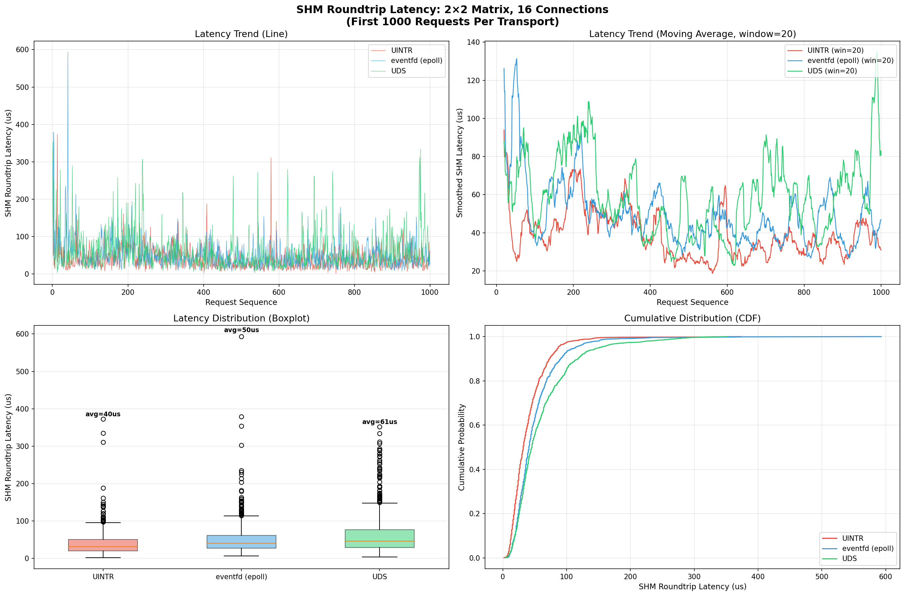
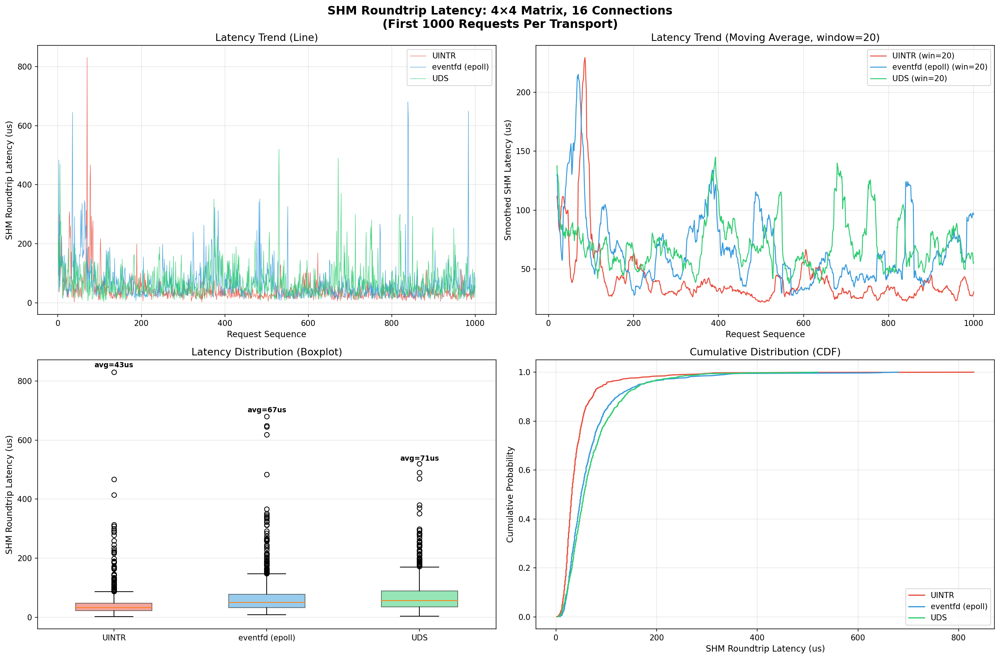

# 关于如何降低中断开销的尝试

当前中断开销的主要来源在于频繁用户态中断打断计算协程运行。

为了解决唤醒死锁的问题，在中断处理程序中调用sys_write 写入self pipe的读端从而产生一个事件唤醒 epoll_wait。

思路一：生成一个专用的阻塞协程，这个阻塞协程会单独占用一个线程，专门负责接收用户态中断，并且唤醒 异步用户态等待协程。

阻塞协程使用epoll_wait 等待用户态中断的唤醒，这样也可以省下一定的开销。

目前只需要把用户态中断的注册挪到这个阻塞线程确保中断能够正确路由即可。

同时去掉 中断处理程序中的 pipe write。


# 测试结果

1s 压力测试结果

```
====================================================================================================
SHM 往返延迟分析报告
====================================================================================================
生成时间: 2026-05-23 23:48:20
日志目录: log/matrix_latency_20260523-233130/
测试数量: 36
传输方式: shm-uintr, shm-eventfd, shm-uds

====================================================================================================
SHM 往返延迟详细数据
====================================================================================================

    传输方式       矩阵   并发   轮     平均(us)     最小     最大      P50      P95      P99       样本
---------------------------------------------------------------------------------------------------
   shm-uintr        2      8    1       32.3        0      671       26       64      145    11206
   shm-uintr        2      8    2       27.4        1      539       23       51      109    12741
 shm-eventfd        2      8    1       41.8        5      984       34       84      218    10231
 shm-eventfd        2      8    2       37.3        7      734       32       66      126    11751
     shm-uds        2      8    1       32.1        1      700       26       74      115    12106
     shm-uds        2      8    2       35.3        3      565       28       82      134    11065
   shm-uintr        2     16    1       41.4        0     1437       32       90      175    17576
   shm-uintr        2     16    2       40.2        0      632       32       90      171    17240
 shm-eventfd        2     16    1       57.4        1      931       47      119      270    15179
 shm-eventfd        2     16    2       61.8        3      690       51      122      236    14941
     shm-uds        2     16    1       72.1        4      945       56      173      336    12936
     shm-uds        2     16    2       75.4        5      842       62      176      297    12739

   shm-uintr        4      8    1       29.8        0      578       23       61      120    11314
   shm-uintr        4      8    2       23.8        0      629       19       48       75    12746
 shm-eventfd        4      8    1       33.7        2      638       28       67      108    10795
 shm-eventfd        4      8    2       37.5        7      603       30       72      197     9966
     shm-uds        4      8    1       36.1        3      495       29       83      131    10152
     shm-uds        4      8    2       34.6        3      671       29       76      114    10753
   shm-uintr        4     16    1       43.8        2     1140       34       97      210     3265
   shm-uintr        4     16    2       45.4        0     1010       33      108      240    15921
 shm-eventfd        4     16    1       67.3        5     1344       55      142      286    13431
 shm-eventfd        4     16    2       67.3        8      806       54      151      321    13801
     shm-uds        4     16    1       78.0        4      760       64      177      299    12041
     shm-uds        4     16    2       76.1        1      917       61      176      314    12333

   shm-uintr        8      8    1       32.8        2      605       23       80      177     9892
   shm-uintr        8      8    2       33.6        2      682       26       70      192    10410
 shm-eventfd        8      8    1       35.1        6      584       28       67      183    10536
 shm-eventfd        8      8    2       46.6        8      822       37      102      202     9089
     shm-uds        8      8    1       37.0        2      447       29       89      136     9816
     shm-uds        8      8    2       39.1        4      630       31       90      154     9443
   shm-uintr        8     16    1       51.6        0      663       40      124      209    13305
   shm-uintr        8     16    2       56.4        0      902       45      131      266    13091
 shm-eventfd        8     16    1       75.7        1      760       62      165      307    11703
 shm-eventfd        8     16    2       84.1        1      799       67      188      468    11128
     shm-uds        8     16    1       77.7        5      617       63      188      278    10979
     shm-uds        8     16    2       81.8        5      736       69      183      271    10944


====================================================================================================
传输方式SHM延迟对比（us，多轮平均）
====================================================================================================


矩阵大小: 2x2
----------------------------------------------------------------------------------------------------
    并发  shm-uintr_Avg shm-eventfd_Avg    shm-uds_Avg shm-eventfd/shm-uintr shm-uds/shm-uintr shm-uds/shm-eventfd
----------------------------------------------------------------------------------------------------------------
     8           29.9           39.6           33.7         1.33x         1.13x         0.85x
    16           40.8           59.6           73.8         1.46x         1.81x         1.24x


矩阵大小: 4x4
----------------------------------------------------------------------------------------------------
    并发  shm-uintr_Avg shm-eventfd_Avg    shm-uds_Avg shm-eventfd/shm-uintr shm-uds/shm-uintr shm-uds/shm-eventfd
----------------------------------------------------------------------------------------------------------------
     8           26.8           35.6           35.4         1.33x         1.32x         0.99x
    16           44.6           67.3           77.0         1.51x         1.73x         1.14x


矩阵大小: 8x8
----------------------------------------------------------------------------------------------------
    并发  shm-uintr_Avg shm-eventfd_Avg    shm-uds_Avg shm-eventfd/shm-uintr shm-uds/shm-uintr shm-uds/shm-eventfd
----------------------------------------------------------------------------------------------------------------
     8           33.2           40.9           38.1         1.23x         1.15x         0.93x
    16           54.0           79.9           79.7         1.48x         1.48x         1.00x

```

```
====================================================================================================
QPS 性能分析报告
====================================================================================================
生成时间: 2026-05-24 01:24:24
日志目录: log/matrix_qps_20260524-010630/
测试数量: 36
传输方式: shm-uintr, shm-eventfd, shm-uds

====================================================================================================
QPS 详细数据
====================================================================================================

        传输方式       矩阵     并发    轮          QPS       平均延迟(us)
--------------------------------------------------------------
   shm-uintr        2      8    1    121,693.2             76
   shm-uintr        2      8    2    123,215.5             74
 shm-eventfd        2      8    1     99,819.6             86
 shm-eventfd        2      8    2    103,662.0             83
     shm-uds        2      8    1    102,803.0             83
     shm-uds        2      8    2    100,616.6             84
   shm-uintr        2     16    1    170,862.5             98
   shm-uintr        2     16    2    171,676.9             97
 shm-eventfd        2     16    1    148,425.8            111
 shm-eventfd        2     16    2    137,483.5            124
     shm-uds        2     16    1    130,450.5            127
     shm-uds        2     16    2    125,429.6            130

   shm-uintr        4      8    1    122,074.0             72
   shm-uintr        4      8    2    121,819.1             72
 shm-eventfd        4      8    1    105,787.1             80
 shm-eventfd        4      8    2    100,785.2             86
     shm-uds        4      8    1    109,166.4             78
     shm-uds        4      8    2    100,852.1             83
   shm-uintr        4     16    1    152,050.9            111
   shm-uintr        4     16    2    143,562.1            116
 shm-eventfd        4     16    1    124,754.4            127
 shm-eventfd        4     16    2    128,034.6            130
     shm-uds        4     16    1    117,618.0            137
     shm-uds        4     16    2    113,742.9            141

   shm-uintr        8      8    1    102,398.6             89
   shm-uintr        8      8    2    105,084.1             88
 shm-eventfd        8      8    1     89,485.9            103
 shm-eventfd        8      8    2     82,453.3             96
     shm-uds        8      8    1     93,844.7             88
     shm-uds        8      8    2     87,058.4             98
   shm-uintr        8     16    1    125,347.1            133
   shm-uintr        8     16    2    127,625.4            130
 shm-eventfd        8     16    1    111,295.8            147
 shm-eventfd        8     16    2    111,653.4            149
     shm-uds        8     16    1     99,051.2            164
     shm-uds        8     16    2    103,235.9            157


====================================================================================================
传输方式 QPS 对比（多轮平均）
====================================================================================================


矩阵大小: 2x2
----------------------------------------------------------------------------------------------------
    并发  shm-uintr_QPS shm-eventfd_QPS    shm-uds_QPS shm-eventfd/shm-uintr shm-uds/shm-uintr shm-uds/shm-eventfd
----------------------------------------------------------------------------------------------------------------
     8       122454.4       101740.8       101709.8         0.83x         0.83x         1.00x
    16       171269.7       142954.7       127940.1         0.83x         0.75x         0.89x


矩阵大小: 4x4
----------------------------------------------------------------------------------------------------
    并发  shm-uintr_QPS shm-eventfd_QPS    shm-uds_QPS shm-eventfd/shm-uintr shm-uds/shm-uintr shm-uds/shm-eventfd
----------------------------------------------------------------------------------------------------------------
     8       121946.5       103286.1       105009.2         0.85x         0.86x         1.02x
    16       147806.5       126394.5       115680.5         0.86x         0.78x         0.92x


矩阵大小: 8x8
----------------------------------------------------------------------------------------------------
    并发  shm-uintr_QPS shm-eventfd_QPS    shm-uds_QPS shm-eventfd/shm-uintr shm-uds/shm-uintr shm-uds/shm-eventfd
----------------------------------------------------------------------------------------------------------------
     8       103741.3        85969.6        90451.5         0.83x         0.87x         1.05x
    16       126486.3       111474.6       101143.5         0.88x         0.80x         0.91x

```





# 遇到的问题

如果压测软件运行的时间越长，QPS测试结果越差。

比如60s压测结果


```
====================================================================================================
QPS 性能分析报告
====================================================================================================
生成时间: 2026-05-24 00:45:48
日志目录: log/matrix_qps_20260523-034904/
测试数量: 367
传输方式: shm-uintr, shm-eventfd, shm-uds

====================================================================================================
QPS 详细数据
====================================================================================================

        传输方式       矩阵     并发    轮          QPS       平均延迟(us)
--------------------------------------------------------------
   shm-uintr        2      8    1    122,328.3           4830
   shm-uintr        2      8    2      4,565.5             61
   shm-uintr        2      8    3      6,247.5             63
 shm-eventfd        2      8    1    112,228.3             82
 shm-eventfd        2      8    2    115,698.9             76
 shm-eventfd        2      8    3    112,345.3             79
     shm-uds        2      8    2    110,831.8             76
     shm-uds        2      8    3    109,770.5             79
   shm-uintr        2     16    1     33,264.3             92
   shm-uintr        2     16    2     14,496.2             93
   shm-uintr        2     16    3    105,200.1           5740
 shm-eventfd        2     16    1    146,082.3            115
 shm-eventfd        2     16    2    145,696.6            115
 shm-eventfd        2     16    3    146,802.4            114
     shm-uds        2     16    1    130,384.8            125
     shm-uds        2     16    2    131,676.5            124
     shm-uds        2     16    3    132,373.2            124
```

此时计算量大，反而数据比较正常
```
   shm-uintr      128      8    1      3,836.2           2150
   shm-uintr      128      8    2     12,848.5            711
   shm-uintr      128      8    3      3,832.6           2150
 shm-eventfd      128      8    1      3,716.6           2200
 shm-eventfd      128      8    2      3,707.9           2200
 shm-eventfd      128      8    3      3,713.7           2200
     shm-uds      128      8    1      3,498.4           2320
     shm-uds      128      8    2      3,501.8           2310
     shm-uds      128      8    3      3,511.0           2300
   shm-uintr      128     16    1      5,128.4           3200
   shm-uintr      128     16    2      5,197.2           3160
   shm-uintr      128     16    3      5,248.8           3130
 shm-eventfd      128     16    1      5,907.4           2790
 shm-eventfd      128     16    2      5,493.2           3000
 shm-eventfd      128     16    3      5,535.7           2980
     shm-uds      128     16    1      5,601.8           2910
     shm-uds      128     16    2      4,971.8           3290
     shm-uds      128     16    3      4,981.3           3290
```

## 初步分析

如果运行的时间过长

```
2026-05-23T16:22:32.522614Z  WARN gateway::shm_transport_uintr: SHM: 33us
2026-05-23T16:22:32.522682Z  WARN gateway::shm_transport_uintr: SHM: 24us
2026-05-23T16:22:32.522746Z  WARN gateway::shm_transport_uintr: SHM: 33us
2026-05-23T16:22:32.522830Z  WARN gateway::shm_transport_uintr: SHM: 17us
2026-05-23T16:22:32.522890Z  WARN gateway::shm_transport_uintr: SHM: 22us
2026-05-23T16:22:32.522968Z  WARN gateway::shm_transport_uintr: SHM: 29us
2026-05-23T16:23:28.281284Z  WARN gateway: Error serving connection from 127.0.0.1:55612: connection closed before message completed
2026-05-23T16:23:28.281349Z  WARN gateway: Error serving connection from 127.0.0.1:55552: connection closed before message completed
2026-05-23T16:23:28.281372Z  WARN gateway: Error serving connection from 127.0.0.1:55606: connection closed before message completed
2026-05-23T16:23:28.281394Z  WARN gateway: Error serving connection from 127.0.0.1:55604: connection closed before message completed
2026-05-23T16:23:28.281420Z  WARN gateway: Error serving connection from 127.0.0.1:55590: connection closed before message completed
2026-05-23T16:23:28.281441Z  WARN gateway: Error serving connection from 127.0.0.1:55574: connection closed before message completed
2026-05-23T16:23:28.281466Z  WARN gateway: Error serving connection from 127.0.0.1:55568: connection closed before message completed
2026-05-23T16:23:28.281490Z  WARN gateway: Error serving connection from 127.0.0.1:55550: connection closed before message completed

```

原本以为是wrk无法支持更高的并发，换了一个压测软件oha，问题还是一样出现。

阻塞的线程基本上都在接收中断和处理中断。

**假设：UIPI 高频风暴导致 uintr 硬件/内核层面的处理瓶颈**


8 个连接 × m2 矩阵（~100μs 计算）= 每秒 10 万次 `senduipi()`

当 8 个 CPU 核心在极短时间内（比如同一微秒级时间窗口）向同一个目标核心发送 UIPI 时，会发生什么？

1. **硬件中断合并 (Interrupt Coalescing)**：CPU 的 local APIC 可能合并相近的中断
2. **内核 UIPI 队列溢出**：内核维护的 UIPI 队列有上限，高频下可能丢弃
3. **目标核心的 UIPI handler 被反复调用**：handler 执行期间新 UIPI 被阻塞/排队

**1 秒钟内**，这些效应还在容忍范围内，seq 计数器的补救机制能兜底。**1 分钟内**，累积的硬件排队延迟、内核队列竞争等导致延迟指数级增长，最终表现为吞吐量崩溃。
