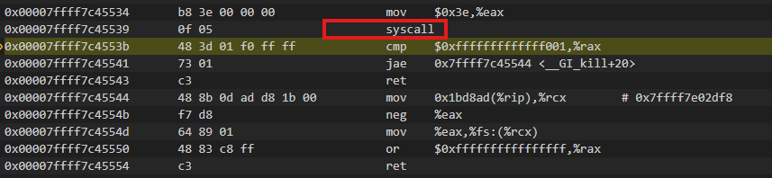
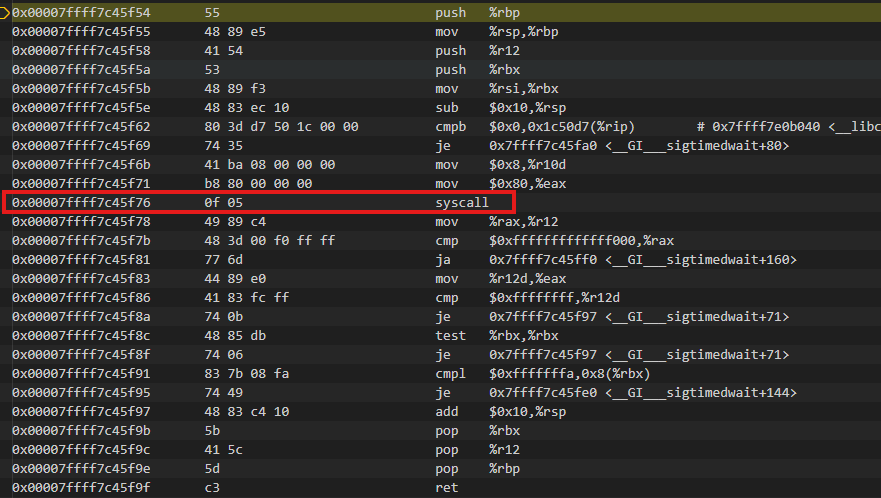

# signal 调用分析

## client
```c
    wait_for_signal(signal_action);
    notify_server();
```

## server
```c
    notify_client();
    wait_for_signal(signal_action);
```


## 信号发送方
```c
void notify_server() {
	kill(0, SIGUSR1);
}

void notify_client() {
	kill(0, SIGUSR2);
}
```

/usr/src/glibc/glibc-2.39/sysdeps/unix/syscall-template.S

```c
T_PSEUDO (SYSCALL_SYMBOL, SYSCALL_NAME, SYSCALL_NARGS)
```

kill 反汇编


## 信号接受方
```c
void wait_for_signal(struct sigaction *signal_action) {
	int signal_number;
	sigwait(&(signal_action->sa_mask), &signal_number);
}

/usr/src/glibc/glibc-2.39/sysdeps/unix/sysv/linux/sigwait.c
int
__sigwait (const sigset_t *set, int *sig)
{
  siginfo_t si;
  int ret;
  do
    ret = __sigtimedwait (set, &si, 0);
  /* Applications do not expect sigwait to return with EINTR, and the
     error code is not specified by POSIX.  */
  while (ret < 0 && errno == EINTR);
  if (ret < 0)
    return errno;
  *sig = si.si_signo;
  return 0;
}

```

__sigtimedwait的反汇编




Result 和运行次数有关，一般来说运行次数越多，平均耗时越短。
其次是同一批次的收发，后面发送信号的延时更短，可能是因为TLB和Cache命中率高的原因

这个时间统计包括服务端发送信号和等待信号，所以其实是两次信号传递的时间。

```c
============ RESULTS ================
Message count:      1000
Average duration:   16.244      us
Minimum duration:   14.592      us
Maximum duration:   144.640     us
=====================================

============ RESULTS ================
Message count:      1000
Average duration:   18.597      us
Minimum duration:   9.728       us
Maximum duration:   257.536     us
=====================================

time[1] = 217.856 us
time[2] = 36.864 us
time[660] = 15.616 us
time[791] = 133.632 us
time[999] = 6.912 us
```

kill syscall  触发 CPU 从 ring3 切到 ring0，进入内核通用入口entry_SYSCALL_64，完
成
切换到当前 CPU 的内核栈；
保存用户态的 RIP / RFLAGS / 通用寄存器；
根据 rax 中的系统调用号找到对应的内核实现函数；
调用通用 C 函数 do_syscall_64()，后者再调用具体的 sys_kill

```c
SYSCALL_DEFINE2(kill, pid_t, pid, int, sig)
{
    struct kernel_siginfo info;

    // 1. 构造要发送的 siginfo（谁发的、发什么信号）
    prepare_kill_siginfo(sig, &info, PIDTYPE_TGID);

    // 2. 根据 pid 语义把信号分发出去
    return kill_something_info(sig, &info, pid);
}

// 准备信号元数据
static void prepare_kill_siginfo(int sig,
                                 struct kernel_siginfo *info,
                                 enum pid_type type)
{
    clear_siginfo(info);
    info->si_signo = sig;
    info->si_errno = 0;
    info->si_code  = (type == PIDTYPE_PID) ? SI_TKILL : SI_USER;
    info->si_pid   = task_tgid_vnr(current);  // 发送者 PID
    info->si_uid   = from_kuid_munged(current_user_ns(), current_uid());
}

// 根据 POSIX 定义的 pid 语义来决定目标集合：
static int kill_something_info(int sig,
                               struct kernel_siginfo *info,
                               pid_t pid)
{
    int ret;

    if (pid > 0)
        return kill_proc_info(sig, info, pid);   // 发给单个进程

    if (pid == INT_MIN)
        return -ESRCH;

    read_lock(&tasklist_lock);

    if (pid != -1) {
        // pid < 0 ：按进程组号 -pid
        // pid == 0：当前进程组 当前的例子就是旺整个进程组发送
        ret = __kill_pgrp_info(sig, info,
                               pid ? find_vpid(-pid) : task_pgrp(current));
    } else {
        // pid == -1 ：（几乎）发给所有进程
        ret = kill_all_info(sig, info);
    }

    read_unlock(&tasklist_lock);
    return ret;
}

int __kill_pgrp_info(int sig,
                     struct kernel_siginfo *info,
                     struct pid *pgrp)
{
    struct task_struct *p = NULL;
    int ret = -ESRCH;

    // 枚举该进程组的所有 task_struct
    do_each_pid_task(pgrp, PIDTYPE_PGID, p) {
        int err = group_send_sig_info(sig, info, p, PIDTYPE_PGID);
        if (ret)
            ret = err;
    } while_each_pid_task(pgrp, PIDTYPE_PGID, p);

    return ret;
}

int group_send_sig_info(int sig,
                        struct kernel_siginfo *info,
                        struct task_struct *p,
                        enum pid_type type)
{
    int ret;

    // 权限检查（sender 是否可以向 p 发送这个信号）
    ret = check_kill_permission(sig, info, p);
    if (ret)
        return ret;

    if (sig)
    // 真正把信号挂到目标上
        ret = do_send_sig_info(sig, info, p, type);

    return ret;
}

int do_send_sig_info(int sig,
                     struct kernel_siginfo *info,
                     struct task_struct *p,
                     enum pid_type type)
{
    unsigned long flags;
    int ret = -ESRCH;

    // 加锁保护 task 的 signal/sighand 结构
    if (lock_task_sighand(p, &flags)) {
        ret = send_signal_locked(sig, info, p, type);
        unlock_task_sighand(p, &flags);
    }
    return ret;
}

static int __send_signal_locked(int sig,
                                struct kernel_siginfo *info,
                                struct task_struct *t,
                                enum pid_type type,
                                bool force)
{
    struct sigpending *pending = &t->pending;
    struct sigqueue *q;

    // 1. 如果信号被忽略且不强制发送，直接返回
    if (sig_ignored(t, sig, force))
        return 0;

    // 2. 分配/复用 sigqueue（用来存储 siginfo）
    q = __sigqueue_alloc(t);
    if (!q) {
        // 资源紧张时有一些特殊逻辑，这里略
        return -EAGAIN;
    }

    // 3. 拷贝 info 到 sigqueue
    copy_siginfo(&q->info, info);

    // 4. 将 sigqueue 挂入 pending 列表
    list_add_tail(&q->list, &pending->list);

    // 5. 设置 pending 位图，唤醒任务
    sigaddset(&pending->signal, sig);
    signal_wake_up(t, sig == SIGKILL || sig == SIGSTOP);

    return 0;
}

void signal_wake_up(struct task_struct *t, bool resume)
{
    set_tsk_thread_flag(t, TIF_SIGPENDING); // 标记“有信号待处理”
    if (resume)
        wake_up_state(t, TASK_UNINTERRUPTIBLE | TASK_STOPPED | TASK_TRACED);
    else
        wake_up_process(t);                 // 通用唤醒
}

  entry_SYSCALL_64
    → do_syscall_64
       → sys_kill(pid=0, sig=SIGUSR2)
          → prepare_kill_siginfo()
          → kill_something_info()
             → __kill_pgrp_info()
                → do_each_pid_task(..., p)
                   → group_send_sig_info(sig, info, p, PIDTYPE_PGID)
                      → do_send_sig_info()
                         → send_signal_locked()
                            → __send_signal_locked()
                               → signal_wake_up(p, ...)
```

从接收方的角度来看

当某个线程正在用户态跑，别的线程通过 kill() 或内核通过中断给它送信号时：
信号先被挂到该线程/进程的 pending 队列；（set_tsk_thread_flag(A, TIF_SIGPENDING)）
线程本身继续跑，直到下一次进入内核（系统调用、中断、异常、调度、定时器中断等）；
在从内核返回用户态之前，内核检查“是否有待处理信号”（TIF_SIGPENDING 标志）：
有 → 调用 do_signal()，构造栈帧，修改返回地址，让返回用户态时先执行用户的 handler；
没有 → 直接按原计划返回用户态，继续执行原来的代码。

```c
void do_signal(struct pt_regs *regs)
{
    struct ksignal ksig;

    if (!get_signal(&ksig)) // 从进程/线程 pending 队列中选取一个优先级合适的信号
        return;

    if (ksig.ka.sa.sa_handler == SIG_DFL) {
        handle_default_signal(&ksig, regs);
        return;
    }

    if (ksig.ka.sa.sa_handler == SIG_IGN) {
        // 忽略，重新返回用户态
        return;
    }

    // 用户自定义 handler：构造用户态栈帧 
    // 在用户栈上压入信号上下文（原寄存器、原栈指针等信息）；
    // 把返回地址设置为内核提供的 “restorer” 函数（sigreturn 入口）；
    // 把 regs->ip 设置为用户注册的 sa_handler 地址；
    // 从内核返回用户态时，CPU 实际跳到 handler 函数入口；
    // 用户 handler 执行完后，会调用 sigreturn 内核从栈上恢复原先的寄存器和栈；
    setup_rt_frame(&ksig, regs);
}
```

但是如果是 sigwait / rt_sigtimedwait 这类“主动等待信号”的系统调用，则流程略有不同：
- 进程在这些 syscall 中睡眠，内核在等待队列里挂上它；
- 有信号投递时，内核唤醒该线程；
- syscall 返回，把被捕捉到的信号号直接作为返回值给用户态；
- **这类场景里不会再单独触发异步 handler，因为信号已经被同步“消费”掉。**