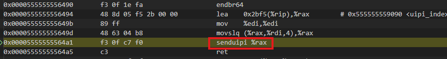
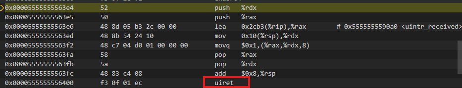

# 用户态中断调用分析

## client
```c
    uintrfd_wait(CLIENT_TOKEN);
    uintrfd_notify(SERVER_TOKEN);
```
## server
```c
    bench.single_start = now();
    uintrfd_notify(CLIENT_TOKEN);
    uintrfd_wait(SERVER_TOKEN);
    benchmark(&bench);
```

## 中断发送方

```c
// 发送用户态中断
void uintrfd_notify(unsigned int token) {
	_senduipi(uipi_index[token]);
}
```
/usr/lib/gcc/x86_64-linux-gnu/13/include/uintrintrin.h

```c
extern __inline void
__attribute__((__gnu_inline__, __always_inline__, __artificial__))
_senduipi (unsigned long long __R)
{
  __builtin_ia32_senduipi (__R);
}

```



### senduipi

senduipi 负责触发用户态中断，具体的硬件行为。

（1）Posting
在目标线程的 UPID（User Posted Interrupt Descriptor） 里，给对应的用户向量置一，表示“这个向量有 pending 的用户中断”。

通过 MSR IA32_UINTR_TT 访问 UITT 表，根据eax传递的参数index定位 UITT entry，
由UITT entry Bits 127:64: UPIDADDR 访问UPID

UPID 是接收方“邮箱”，结构关键字段）：

Bit 0: ON（Outstanding Notification） =1 表示这一轮已经给这个 UPID 发过一次“通知”
Bit 1: SN（Suppress Notifications）   =1 时不再发送通知 IPI，只做 posting
Bits 23:16: NV（Notification Vector）发送 IPI 时用的中断向量号
Bits 63:32: NDST（Notification Destination） 目标 LAPIC ID：

Bits 127:64: PIR（Posted-Interrupt Requests bitmap） 64 位，PIR[UV] = 1 表示对应向量 UV 有 pending 的用户中断，每个发送者注册时会分配一个UV

（2）Notification
根据 UPID 里的状态位（ON/SN）判断：

如果这是这轮里的第一个 pending，并且没有被抑制，那么：置 ON=1
通过 APIC 发出一条“普通 IPI”（向量是 NV，目标是 NDST 指定的 APIC ID）
否则只是在 UPID 里排队，不立刻发 IPI

### UITT

中断发送方使用uintr_register_sender(uvecfd,flags) 创建UITT entry

```c
struct uintr_uitt_entry {
    u8  valid;             /* bit0: 有效 */
    u8  user_vec;          /* 用户向量号 */
    u8  reserved[6];
    u64 target_upid_addr;  /* 目标 UPID 物理地址 */
} __packed __aligned(16);

mm_struct->context 中新增一个 uitt_ctx 指针，单个进程的所有线程共享一张 UITT
struct uintr_uitt_ctx {
    struct uintr_uitt_entry *uitt;     /* 实际 UITT 表内存 */
    struct mutex uitt_lock;           /* 并发保护 */
    refcount_t refs;                  /* 引用 */
    u64 uitt_mask[BITS_TO_U64(UINTR_MAX_UITT_NR)]; /* 哪些 entry 已用 */
    struct uintr_upid_ctx *r_upid_ctx[UINTR_MAX_UITT_NR]; /* 每个 entry 对应的接收方 UPID_CTX */
};
```

### UPID

中断接收方使用uintr_register_handler(handler, flags) 分配 UPID
UPID在内核中的表示
```c
struct uintr_upid {
    struct {
        u8 status;     /* bit 0: ON, bit 1: SN, 其余保留/扩展 (含 BLKD) */
        u8 reserved1;
        u8 nv;         /* Notification vector */
        u8 reserved2;
        u32 ndst;      /* Notification destination (APIC ID) */
    } nc __packed;     /* Notification control */
    u64 puir;          /* Posted user interrupt requests (64-bit bitmap) */
} __aligned(64);

task_struct->thread 里增加指针：thread.upid_ctx
struct uintr_upid_ctx {
    struct list_head node;
    struct task_struct *task;   /* 这个 UPID 对应的接收任务 */
    u64 uvec_mask;              /* 哪些向量已注册（按位） */
    struct uintr_upid *upid;    /* 指向上面的硬件 UPID */
    refcount_t refs;            /* 引用计数 */
    bool receiver_active;       /* 是否当前仍有接收者 */
    bool waiting;               /* 是否当前在阻塞等待 */
    unsigned int waiting_cost;  /* 阻塞开销由谁承担（sender/receiver） */
};

```

## 中断接收方

```c
// 在中断处理程序中将 flag置 1
void __attribute__ ((interrupt))
     __attribute__((target("general-regs-only", "inline-all-stringops")))
     ui_handler(struct __uintr_frame *ui_frame,
		unsigned long long vector) {

		// The vector number is same as the token
		uintr_received[vector] = 1;
}
```


```c
void uintrfd_wait(unsigned int token) {
	// Keep spinning until the interrupt is received
	while (!uintr_received[token]);
    // 在wait中将 flag置 0
	uintr_received[token] = 0;
}
```


### 情况一

接收方当前正在用户态(CPL=3) 运行

发送方执行 senduipi 发送 IPI，接收方所在的CPU 根据中断向量 NV 和自身的MSR_IA32_UINTR_MISC 的配置，判断出中断是用户中断。从而触发以下的硬件行为

（1）从 MSR_IA32_UINTR_PD 取出当前任务的 UPID 地址。

（2）检查 UPID 状态位，如果SN == 0 && ON == 0，则检查upid->PIR，把 PIR 拷贝到 CPU 内部一个 UIRR（User Interrupt Request Register），然后清理 UPID 上的 PIR 与 ON。

（3）硬件在当前用户栈上压入：被中断的 RIP、RSP、RFLAGS 等

（4）从最高优先（63）往下扫描 UIRR 里为 1 的 bit，选中某个向量 v，清掉该 bit，把 v 作为参数（或压栈）传给 handler

（5）跳转到 MSR_IA32_UINTR_HANDLER 指向的用户态 handler，CPU 设置 RIP = MSR_IA32_UINTR_HANDLER（用户态地址）

（6）执行完handler后，通过uiret恢复进入 handler 前保存的 RIP / RSP / RFLAGS 等
，清除中断处理状态，回到被中断的那条用户指令之后继续执行

### 情况二

接收方处于内核态或者睡眠状态

内核会在调度切出/进入内核时通过switch_uintr_prepare(prev)设置 SN=1，抑制通知
在 SN=1 时，senduipi 只会置 PIR 位，不发送 IPI。

线程准备回用户态前，内核在 switch_uintr_return() 系统调用返回路径里：清除 SN；如果 PIR != 0，调用apic->send_IPI_self(UINTR_NOTIFICATION_VECTOR)向当前CPU发送 self‑IPI。iret从内核态返回后，恢复用户态的 EFLAGS.IF 开启中断，接收IPI，按“情况一”路径进入用户态 handler。

```c
// Called from arch_exit_to_user_mode_prepare() with interrupts disabled.
void switch_uintr_return(void)
{
	rdmsrl(MSR_IA32_UINTR_MISC, misc_msr);
	if (!(misc_msr & GENMASK_ULL(39, 32))) {
		misc_msr |= (u64)UINTR_NOTIFICATION_VECTOR << 32;
		wrmsrl(MSR_IA32_UINTR_MISC, misc_msr);
	}
	
	upid = current->thread.upid_ctx->upid;
	upid->nc.ndst = cpu_to_ndst(smp_processor_id());
	clear_bit(UINTR_UPID_STATUS_SN, (unsigned long *)&upid->nc.status);

	if (READ_ONCE(upid->puir))
		apic->send_IPI_self(UINTR_NOTIFICATION_VECTOR);
}
```

调用路径
```
__syscall_exit_to_user_mode_work() / irqentry_exit_to_user_mode() ->exit_to_user_mode_prepare()->arch_exit_to_user_mode_prepare()->switch_uintr_return()
```

## uintr-bi性能
```
============ RESULTS ================
Message size:       1
Message count:      1000
Average duration:   1.221       us
Minimum duration:   1.024       us
Maximum duration:   3.840       us
Message rate:       376252      msg/s
=====================================

time[0] = 2.304 us
time[1] = 2.048 us
time[2] = 1.792 us
time[985] = 1.024 us
time[999] = 1.280 us
```