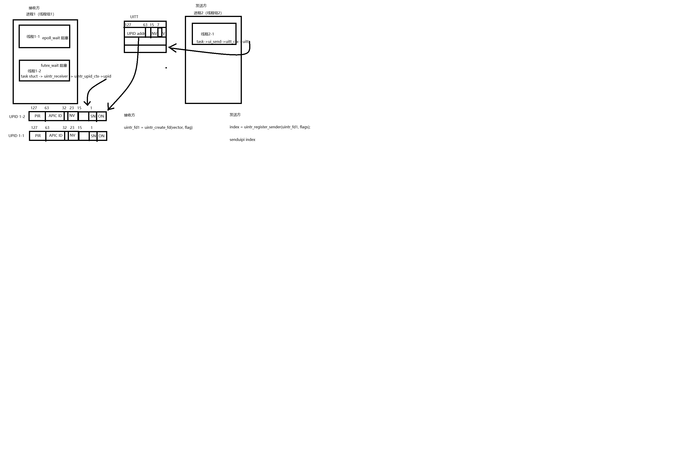
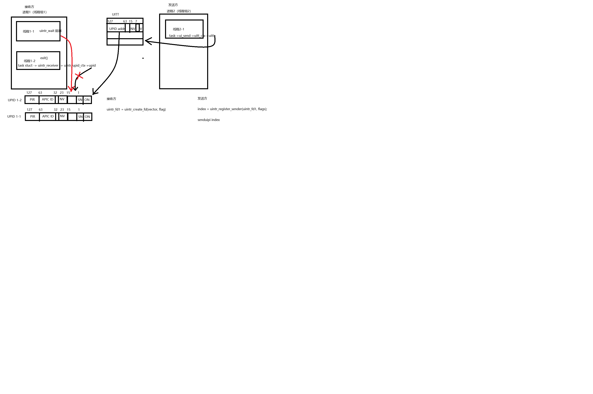

# 进程导向用户态中断的分析2

tokio 的多核运行时，一开始就指定需要创建多少个工作线程（默认值为当前CPU的核数），

如果没有协程可执行，那么所有工作线程都会进入阻塞状态（不会exit释放），其中只有一个线程阻塞在epoll_wait IO协程，其他线程则阻塞在futex_wait协程。

假如是线程2注册了用户态中断，线程1没有注册用户态中断，发送方senduipi，就只会给线程2发送中断。

这样的问题是如果线程1执行的epoll_wait IO协程。线程2执行的futex_wait 协程，就无法让runtime正常被唤醒。

新的讨论进展是，如果没有协程可执行（比如所有协程都在等待阶段），那么只有一个线程阻塞在uintr_wait IO协程，其他线程则自动exit，也就是释放核。

线程2在退出之前，需要让线程1接管用户态中断。（即保留发送方进程通知接收方进程的能力）

如何实现这个接管功能？发送方的senduipi index会从UITT表中找到UITTE，从而定位到接收方的UPID。

那么是否只需要线程1的UPID执行原本线程2的UPID即可。或者变更发送方的UITTE中的UPID地址为线程1的UPID。或者干存让发送方再执行一次系统调用注册成线程1的发送方。

对于发送方来说，发送方不知道原本的线程2合适退出，接收方线程的变更应该是透明的，所以变更发送方UITTE是不合适的。发送方再执行一次系统调用注册为线程1的发送方更不合适。

所以只能从线程1的UPID入手。假如线程1没有注册过用户态中断，那么比较好办，执行让线程1执行线程2的UPID。假如线程2注册过用户态中断，那么线程1和线程2的UPID如何合并是一个大的问题。

当然，即使不考虑线程2的退出，只考虑线程2的阻塞，希望在线程2阻塞期间，线程1就能接管其用户态中断，也还是会引发上面所述的问题。

解决办法就是线程组共享用户态中断

同一个线程组的所有线程共享中断向量空间和UPID数据结构uintr_upid_ctx，用户态中断处理函数。

组内任意一个线程注册后，所有成员都具备接收和处理用户态中断的能力（实际只选择一个线程负责响应）。

即便线程组内原本注册中断的线程被切出，只要其他线程处于运行态也能够即时响应用户态中断。